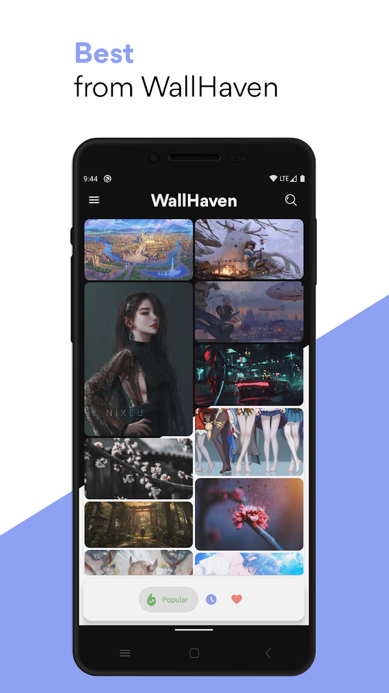
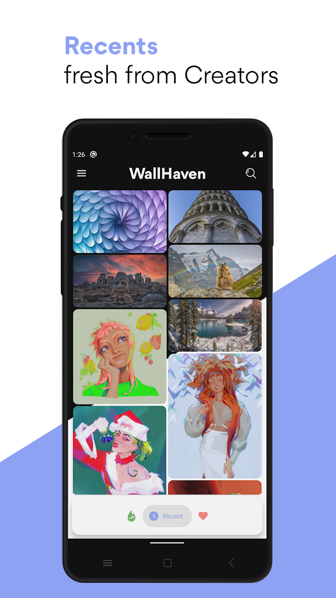
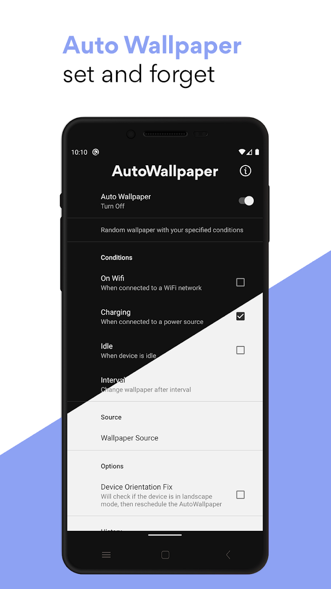

# Walldo- Walls from wallhaven (Android App) 

## Description & Features
An Android based on wallhaven.cc API, using dagger,mvvm & dynamic colors library, gradually upgrading to kotlin
* Minimal Design.
* Dynamic colors.

## Screenshots

## Links
[API used](https://wallhaven.cc/help/api)      
[Playstore](https://play.google.com/store/apps/details?id=com.enigmaticdevs.wallhaven)

