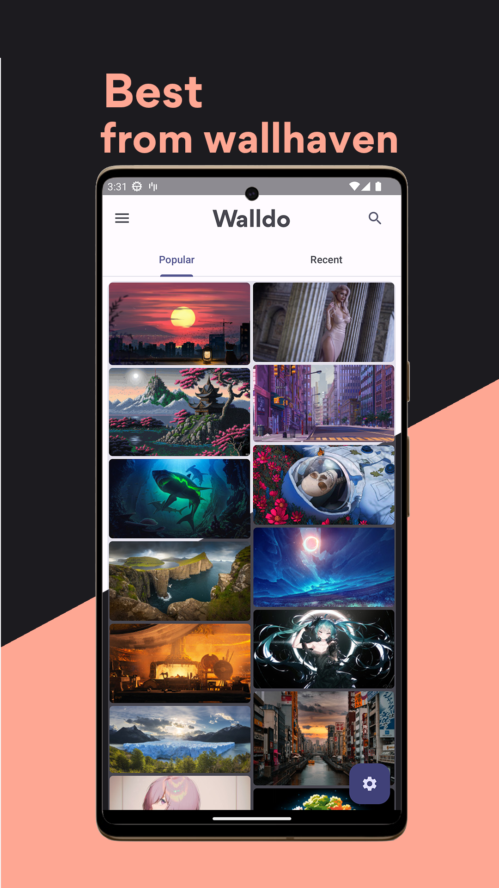
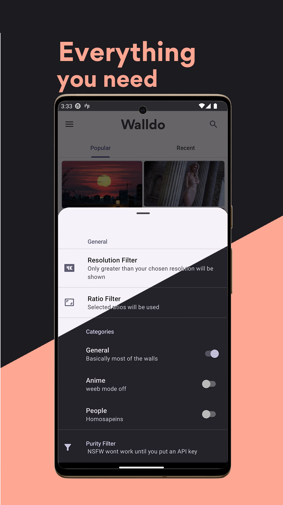

# Walldo- Walls from wallhaven (Android App) 

## Description & Features
An Android app based on wallhaven.cc API, using Dagger Hilt,MVVM & dynamic colors library, gradually upgrading to jetpack Compose
* Minimal Design.
* Dynamic colors & Material3 Design
* AutoWallpaper.
* Favorites Section.

## Libraries Used
* Dagger Hilt
* Retrofit
* Room
* Paging3
* Lottie
* Glide
* WorkManager
* Billing V6
* Android Datastore

## Screenshots

## Links
[API used](https://wallhaven.cc/help/api)      
[Playstore](https://play.google.com/store/apps/details?id=com.enigmaticdevs.wallhaven)
